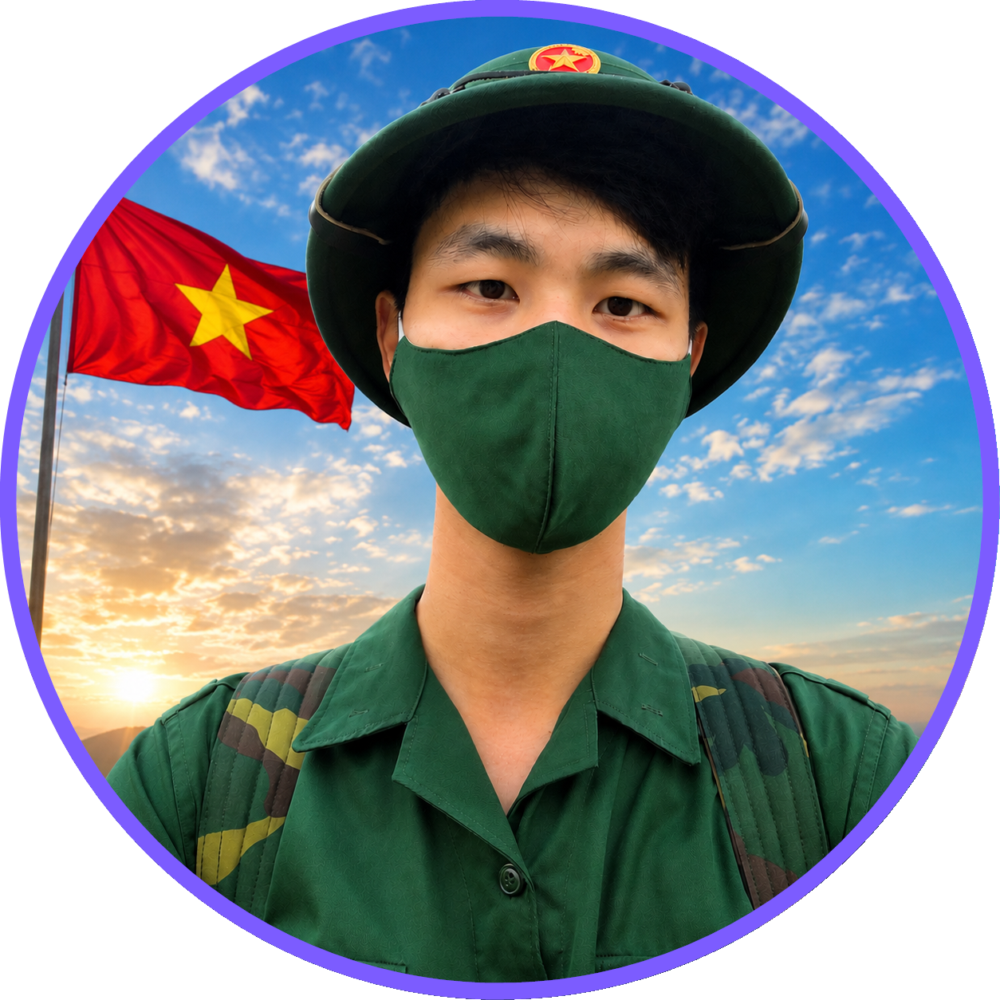
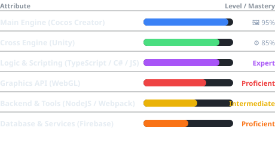
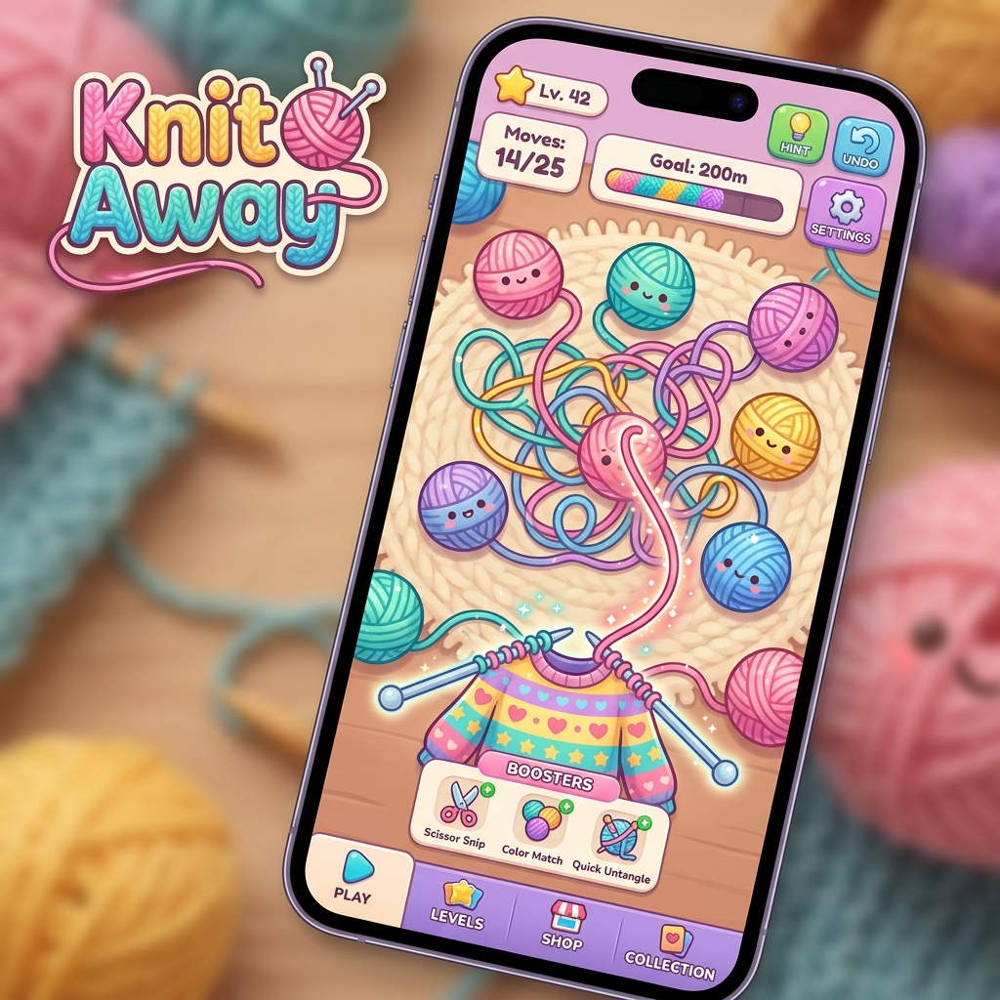
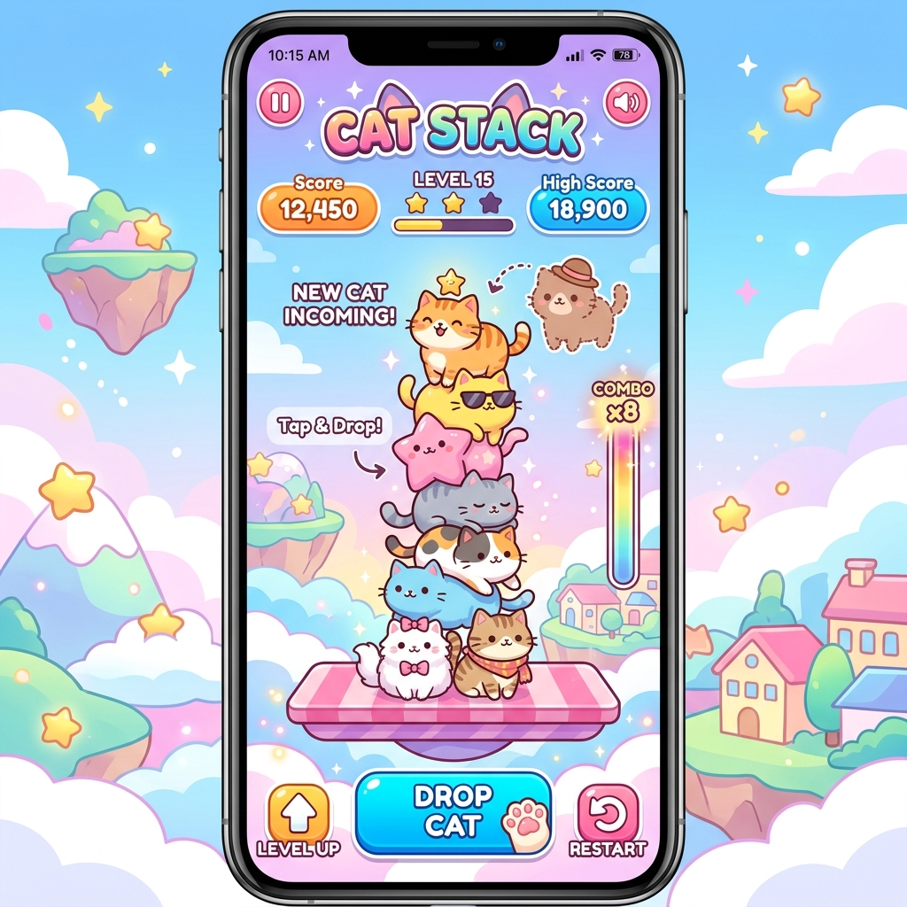
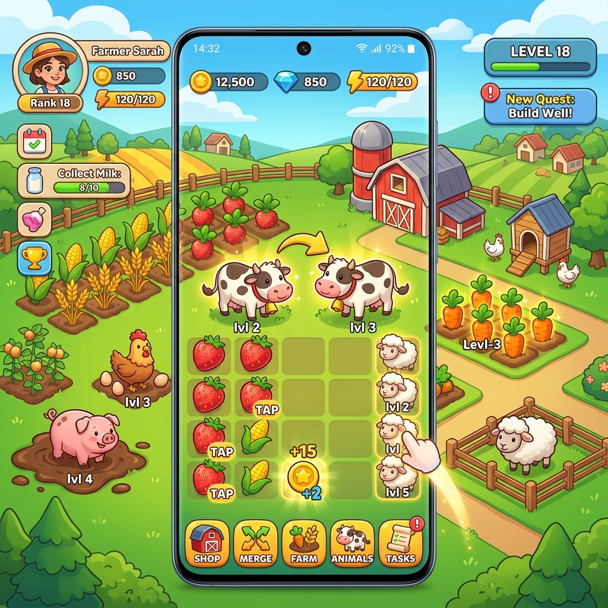

<table>
  <tr>
    <td width="270" align="center" valign="top">
      
    </td>
    <td valign="top">
      <h1>Hi 👋, I'm Duy (Duytv)</h1>
      <h3>A passionate <strong>Senior Game Developer</strong> from Vietnam 🇻🇳</h3>
      

        
        
        
      

      
I build high-performance, engaging, and scalable games across platforms. Passionate about clean code, optimization, and mentoring teams.

    </td>
  </tr>
</table>

  
  
  

---

<table>
  <tr>
    <td width="50%" valign="top">
      <h2>👤 About Me</h2>
      
🎯 <strong>Current Focus:</strong> Building high-performance, engaging and scalable games and playable ads across Mobile, Web, and Instant Platforms.

      
🚀 <strong>Goal:</strong> Creating highly optimized, seamless web gaming experiences and mentoring development teams.

      
🌐 <strong>Based in:</strong> Vietnam (VN)

      
💬 <strong>Languages:</strong> Vietnamese (Native), English (Intermediate)

    </td>
    <td width="50%" valign="top">
      <h2>🎮 Character Stats (Skills)</h2>
      
    </td>
  </tr>
</table>

---

## 🧱 Tech Stack

  
  
  
  
  
  
  
  
  
  

---

## 🖥️ Demo Projects

<table border="1" cellspacing="0" cellpadding="16" align="center">
  <tr>
    <td width="33%" align="center" valign="top">
      
        
      <a href="https://duytv081298.github.io/Duytv081298/Demo/Playable/Knit%20Away/PA141_NhoFake_Duy_140526_applovin.html"><strong>🧶 Knit Away</strong></a>
       
      
Knitting puzzle · Cocos Creator AppLovin playable ad

      
    </td>
    <td width="33%" align="center" valign="top">
      
        
      <a href="https://duytv081298.github.io/Duytv081298/Demo/Playable/Cat%20Stack/CatStack_V7_Duy_030426_applovin.html"><strong>🐱 Cat Stack</strong></a>
       
      
Hyper-casual stacking · Unity High conversion playable ad

      
    </td>
    <td width="33%" align="center" valign="top">
      
        
      <a href="https://duytv081298.github.io/Duytv081298/Demo/Playable/Farm%20Tap/FarmTap_V83_Duy_110526_applovin.html"><strong>🌾 Farm Tap</strong></a>
       
      
Tap &amp; merge farm · Cocos Creator Optimized for mobile ads

      
    </td>
  </tr>
</table>

---

### 📊 GitHub Statistics

  
  

### 🐍 Coding Activity

  <picture>
    <source media="(prefers-color-scheme: dark)" srcset="https://raw.githubusercontent.com/Duytv081298/Duytv081298/snake-assets/github-snake-dark.svg">
    <source media="(prefers-color-scheme: light)" srcset="https://raw.githubusercontent.com/Duytv081298/Duytv081298/snake-assets/github-snake.svg">
    
  </picture>

---

<table align="center">
  <tr>
    <td width="25%" align="center">
      <h2>📅 5+</h2>
      Years Experience
    </td>
    <td width="25%" align="center">
      <h2>🚀 10+</h2>
      Projects Completed
    </td>
    <td width="25%" align="center">
      <h2>❤️ 100%</h2>
      Passion
    </td>
    <td width="25%" align="center">
      <h2>♾️ ∞</h2>
      Keep Learning
    </td>
  </tr>
</table>

© 2025 Duytv · Built with 💜 and ☕

